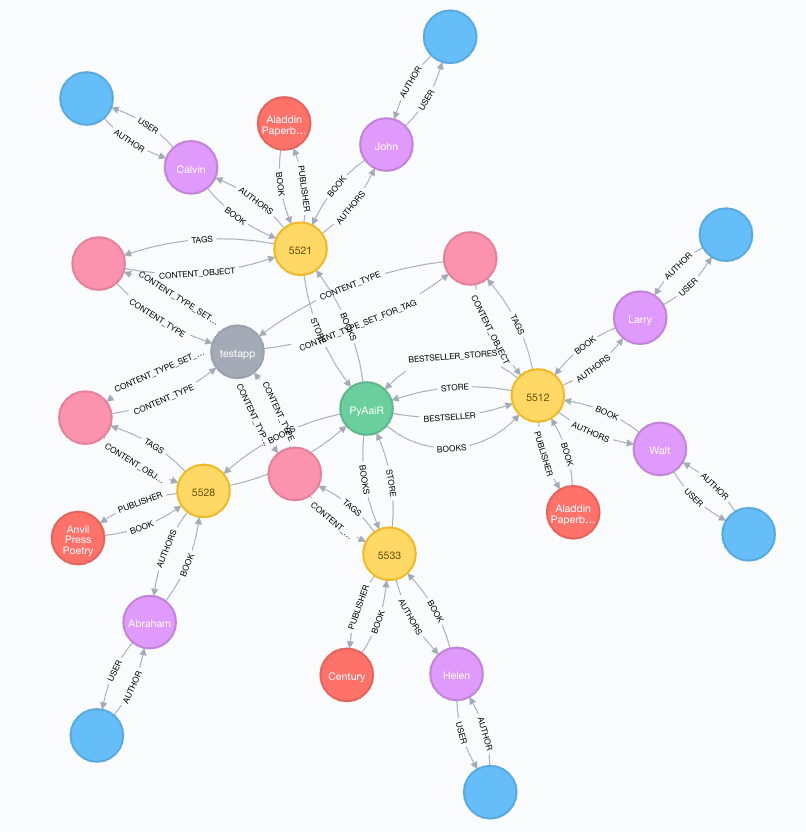

.. _permissions-label:

=======================
Graph based permissions
=======================

Once we have the database mapped and synchronized we have the ability to read relationship data in a
brand new way. We now can generate paths, and inspect the way our dataset is related in a much broader
way than we can with a pure relational database.

One thing we can do is to exploit this and build a permission system on top of it. Let's say we have a user
Esther in the picture above (I know she's not there, it's an old image) which authenticates into the book
store application. We want her to access all books she has written. This can be achieved by the executing the following
`Cypher <https://neo4j.com/developer/cypher-query-language/#_about_cypher>`_ statement.

.. code-block:: cypher

    MATCH (u:UserNode {pk:69})-[AUTHOR]->(a:AuthorNode)-[BOOK]-(b:BookNode) RETURN b

Further, if we want to return all books which is in the same store as one or more books Esther has written,
we could easily extend the above cypher query. Let's store the results in a ``path`` variable as well and
see what happens.

.. code-block:: cypher

    MATCH path = (u:UserNode {pk:69})-[*..3]->(s:StoreNode)-[BOOKS]-(b:BookNode) RETURN path

The above query first finds a ``UserNode`` with property ``pk:69``, then looks at all
relationships 3 steps out, looking for a ``StoreNode`` which it will follow through a relationship called
``BOOKS`` to all nodes of type ``BookNode``. Finally return the ``path`` variable.

As you can see, Cypher is a quite expressive query language.

The idea
========

So, the general idea is to store these queries in a database. When a requests come in and want to access
some object, we'll look up the authenticated user in the graph. Next we'll see if we have the requested object
represented in the graph. Finally we'll check if we have any stored query which can generate a path from
the user node to the object node. If so, return the object.

What's nice about an approach like this, is that we have a truly dynamic rule set for our application. We can
choose to deactivate some rules for a limited time, or we can add or remove rules on the fly in order to let users
either access new kind of data, or restrict their access to already available data.

In order to do that, we'll use :ref:`access-rules-label`.

.. _access-rules-label:

Access rules
============

If you have enabled both ``chemtrails`` and ``chemtrails.contrib.permissions`` in the Django settings file
under ``INSTALLED_APPS``, you should have a similar entry in the Django admin interface.

When evaluating access rules, the permission system will dynamically identify what kind of objects we're dealing
with using the ``ContentType`` framework which ships with Django.

Content Types
-------------

When dealing with authenticated web requests, we'll almost always use ``user`` as our `Source content type`.
This is the kind of object we want to calculate the Cypher path `from`. As for ``Target content type``, choose
whatever object type you want the current access rule to evaluate. Let's follow the example from before
(:ref:`permissions-label`) and create a rule which lets Esther look at all the books in the same book store she
has her books.

So, proceed setting the ``Target content type`` to ``book``. Next write a `good` description for what the
rule is doing. This is very important as you might end up with hundreds of rules in a large application.

Permissions
-----------

Next up is permissions. What kind of permissions should the new rule grant? We don't necessarily want all users
that can view an object to also delete them. Let's grant ``view`` permission for our new access rule.

.. note::

    ``view`` is **not** a standard Django permission. It can be added relatively easily by using
    `custom permissions <https://docs.djangoproject.com/en/dev/topics/auth/customizing/#custom-permissions>`_.

Relation types
--------------

Next up is the ``Relation types`` field. This field contains a JSON-ish string which will be parsed and
converted to Cypher whenever the access rule engine parses the rule.

.. todo::

    Create a GUI widget for creating relation types so end-users don't have to
    understand the weird and confusing syntax.

Unfortunately, this is rather confusing and difficult to work with at the moment, so plans exist in order
to make a GUI widget which will take this fields place.
The following piece of JSON should do:

.. code-block:: javascript

    {"AUTHOR":{"name":"Esther"}},
    {"BOOK":null},
    {"STORE":null},
    {"BOOKS":null}

.. important::

    What's important to notice here is that we **only specify the relationships**! The formatting in the input field
    must be a *comma separated list of JSON objects*, where each object has a *single key* being the relationship
    name, and either ``null`` or a *nested object* containing properties which should be matched for the *relationship
    target*.

Read the above message once more, and make sure you understand whats going on here!

Click the **"Save and continue editing"** button and you should get a nice preview of the generated Cypher
statement right below the ``Relation types`` field.

Take a minute to study the generated code and compare it to the JSON input.
Upon evaluation the ``pk`` property in the ``Source content type`` node will be replaced by whatever primary
key the authenticated user has, so we're sure the path is calculated from the correct node.
Also, the generator algorithm will inspect the Django field type and make sure the path is calculated using the
correct relationships.

Special syntax
..............

**Back references**

We have a few special syntax rules in order to do back references when generating the cypher statement.
Imagine you want to create a path based on a condition in another node. If we look at the example from before,
say we want to get *all books written by Esther which are co-authored by Kelly*. We want to *force* the
cypher generator engine to traverse back to *exactly* the same node (BookNode) as we came from.

.. code-block:: javascript

    {"AUTHOR":{"name":"Esther"}},
    {"BOOK":null},
    {"AUTHORS":{"name":"Kelly"}},
    {"{1:BOOK}":null}  // <- Note the "{1:BOOK}" syntax

By inserting ``{"{1:BOOK}":null}`` as the ``relationship`` name we make a *back reference* to ``target1: BookNode``
in the generated Cypher statement. This might not seem very intuitive (and it isn't) at first, so it might take some
time in order to make it right.

**Source reference**

The other special reference we have is ``{source}``. This can be used in order to reference properties on the source
node. Using the example above we could do something like the below in order to match Esther's age to her primary key
value (which is a rather absurd thing to do, but you get the idea).

.. code-block:: javascript

    {"AUTHOR":{"name":"Esther"}},
    {"BOOK":null},
    {"AUTHORS":{"age":"{source}.pk"}}

Would generate the following Cypher statement:

.. code-block:: cypher

    MATCH path = (source0: UserNode {pk: 69})-[:AUTHOR {type: "OneToOneRel", is_meta: False, remote_field: "auth.user.author", target_field: "testapp.author.id"}]->(target0: AuthorNode {name: "Esther"})-[:BOOK {type: "ManyToManyRel", is_meta: False, remote_field: "testapp.author.book_set", target_field: "testapp.book.id"}]->(target1: BookNode)-[:AUTHORS {type: "ManyToManyField", is_meta: False, remote_field: "testapp.book.authors", target_field: "testapp.author.id"}]->(target2: AuthorNode {age: 69}) RETURN path;

Other security measures
-----------------------

Finally we have the ``Requires staff`` and the ``Is active`` fields. They should be pretty self-explanatory, where
the first requires the authenticated user to be a *staff* user, and the latter can be used to deactivate a rule
instead of deleting it. Inactive rules will not be evaluated.

