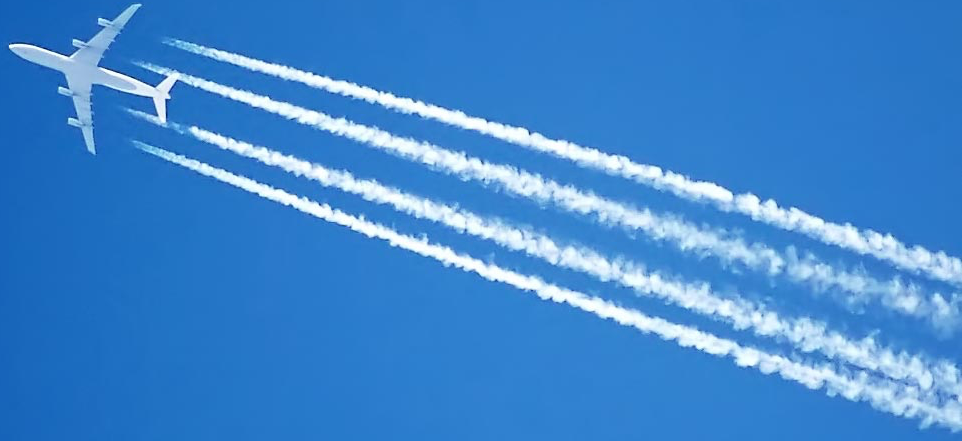

============================
Chemtrails - Graphing Django
============================

.. toctree::
   :maxdepth: 2
   :caption: Table of Contents:
   :name: mastertoc

   01_configuration
   02_contrib_permissions

About
=====

This project aims to solve complex object based permissions by utilizing the relationships
between entities in a graph.

`Why the stupid name?` - I just love conspiracy theorists =)

Features
========

    - Synchronize Django model instances to Neo4j
    - Recursively connect related nodes

Installation
============

.. code-block:: none

    $ pip install django-chemtrails

Requirements
============

    - A Django project
    - Neo4j running and accepting connections using the bolt protocol

Changelog
=========

Some day...

Indices and tables
==================

* :ref:`genindex`
* :ref:`modindex`
* :ref:`search`
